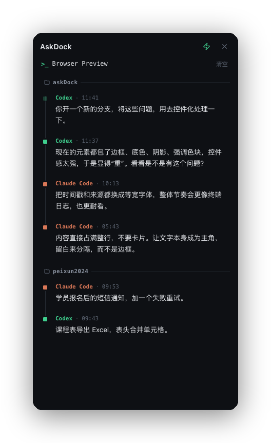

# 问迹 · AskDock

> 你问过的，都还在窗边。

<p align="center">
  
</p>

问迹（AskDock）是一个停在终端旁的 macOS 桌面浮窗：它**自动收集你在 Claude Code、Codex 里问 AI 的每一个问题**，按终端窗口归档。当你切回某个终端窗口，就能看到自己在这儿问过什么、做到哪了。

它**不读终端内容**，也**不用手动输入**——只读取 AI 工具自己的会话记录（transcript）和窗口几何，安静地替你记着。

## 特性

- 🪟 **按窗口归档** —— 每个终端窗口一份提问时间线，切回即见
- 🤖 **自动捕获** —— 抓取 Claude Code（`~/.claude`）、Codex（`~/.codex`）的会话记录，只采集你真正手敲的提问（过滤工具结果、slash 命令、图片块等噪声）
- 📚 **按项目分组** —— 一个窗口跨多个工作目录时，按项目分别显示
- 🐾 **桌面宠物** —— 可收起成屏幕边缘的小人、拖到桌面任意处；复用 [Codex Pets](https://www.aimcp.info/en/codex-pets) 精灵图格式，社区宠物贴个链接即可一键安装
- 🎨 **可定制** —— 多主题、字体、毛玻璃、圆角、贴靠方式
- 🔒 **本地优先** —— 不读终端内容、不联网上传，数据只存在本地 SQLite

## 平台

macOS 为一等公民（窗口检测依赖 macOS Core Graphics，无需辅助功能/录屏权限）。

## 下载

到 [Releases](https://github.com/liuer2024/AskDock/releases) 下载 macOS 通用包。给提交打 `v*` 标签（如 `git tag v0.1.0 && git push origin v0.1.0`）即由 GitHub Actions 自动构建发布。

> 未签名应用：首次打开若被拦，右键图标 → 打开，或在「系统设置 → 隐私与安全性」里点「仍要打开」。

## 开发

```bash
npm install
npm run tauri dev      # 开发：Rust 后端 + webview
npm run tauri build    # 打包成 .app
```

技术栈：**Tauri 2 · React 19 · Vite · Rust · SQLite（rusqlite）**。

## License

[MIT](./LICENSE) © 2026 smiler
